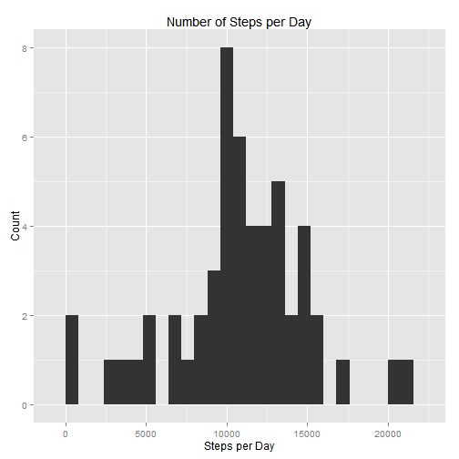
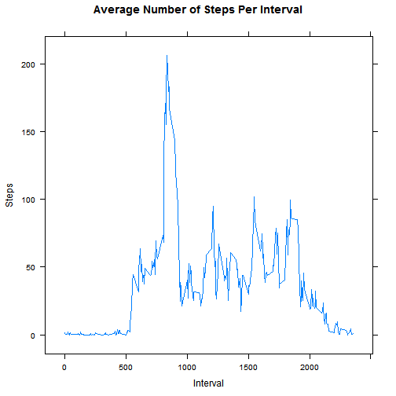
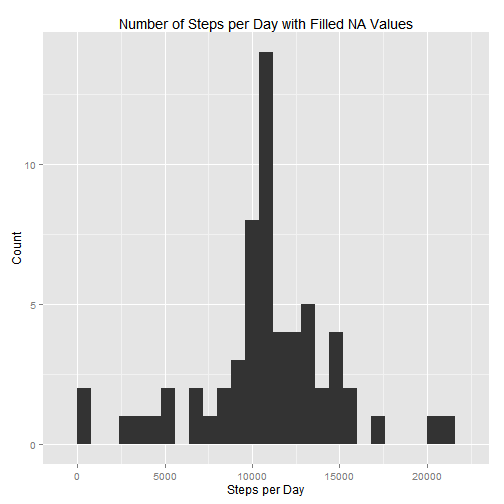
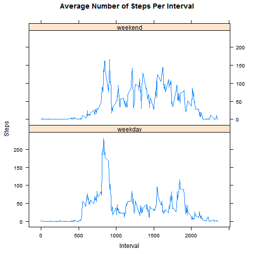

# Reproducible Research: Peer Assessment 1


## Loading and preprocessing the data

The file to be loaded was obtained from this URL: [https://d396qusza40orc.cloudfront.net/repdata%2Fdata%2Factivity.zip](https://d396qusza40orc.cloudfront.net/repdata%2Fdata%2Factivity.zip)

It consists of activity monitoring data obtained from a personal activity monitoring device.  The zip file contains a single CSV file named 'activity.csv'.  It consists of 17,568 observations with the following columns:

* steps: Number of steps taking in a 5-minute interval. Missing values are coded as NA
* date: The date on which the measurement was taken, in YYYY-MM-DD format
* interval: Identifier for the 5-minute interval in which measurement was taken


```r
# Check if csv file exists
# If not, unzip activity.zip file
if (!file.exists("./activity.csv")) {
  unzip("./activity.zip",
        list=FALSE,
        overwrite=TRUE,
        unzip="internal")
}

# Read in activity table as data frame
activity <- read.table("./activity.csv",
                    sep=",",
                    header=TRUE,
                    colClasses=c("numeric", "Date", "numeric"),
                    na.strings=c("NA")
)
```


## What is mean total number of steps taken per day?

This will sum the number of steps taken on each date, and then calculate the mean number of steps per date.  NA values are not included in the aggregation, so are not included in the mean calculation.


```r
# Compute total number of steps on each date
# NA values are not included in the aggregate
steps_by_date <- aggregate(steps ~ date, data=activity, FUN=sum)

# Produce a histogram of the step counts by date
library(ggplot2)
p1 <- qplot(steps, data=steps_by_date, geom="histogram", binwidth=800)
p1 + labs(list(title="Number of Steps per Day", x="Steps per Day", y="Count"))
```

 

The plot is a histogram of the total number of steps on each date.

Here, we calculate the mean and median number of steps on each date.

```r
# Compute the mean steps per date, without NA values
mean(steps_by_date$steps)
```

```
## [1] 10766
```

```r
# Compute the median steps per date, without NA values
median(steps_by_date$steps)
```

```
## [1] 10765
```


## What is the average daily activity pattern?

Now we wish to determine the activity pattern during each time interval, averaged over all dates.  We do this by taking the mean number of steps in each interval.


```r
# Find mean number of steps for each interval, calculated over all dates
average_steps_by_interval <- aggregate(steps ~ interval, data=activity, FUN=mean)

# Plot the mean number of steps during each interval
library(lattice)
xyplot(steps ~ interval, data=average_steps_by_interval, type="l", main="Average Number of Steps Per Interval", xlab="Interval", ylab="Steps")
```

 

We can use this to determine which interval has the greatest mean number of steps.


```r
# Find the interval with the largest mean number of steps
average_steps_by_interval[which.max(average_steps_by_interval$steps),]
```

```
##     interval steps
## 104      835 206.2
```

From the result, it appears interval 835 has the largest mean number of steps, with about 206.

## Imputing missing values

Now we wish to count and describe the missing values in the data.  First we count the number of missing values.


```r
# Calculate number of NA rows
sum(is.na(activity))
```

```
## [1] 2304
```

Now we want to fill the NA values in the data with reasonable values.  For this, we will use the mean number of steps calculated in each interval.  Then we produce the histogram of the resulting activity data.


```r
# Count number of dates
dates <- unique(activity$date)
# Construct data frame of dates from averages
average_activity_frame <- merge(average_steps_by_interval, data.frame(date=dates), by=NULL)
average_activity_frame <- average_activity_frame[,c(2,3,1)]

# Construct masks of indices with and without NA values
na_mask <- which(is.na(activity))
not_na_mask <- which(!is.na(activity))

# Copy activity data frame
filled_activity = data.frame(activity)
# Fill NA values from average activity for that interval
filled_activity[na_mask,] <- average_activity_frame[na_mask,]

# Produce the aggregated data frame with the filled set and plot it
filled_steps_by_date <- aggregate(steps ~ date, data=filled_activity, FUN=sum)
p1 <- qplot(steps, data=filled_steps_by_date, geom="histogram", binwidth=800)
p1 + labs(list(title="Number of Steps per Day with Filled NA Values", x="Steps per Day", y="Count"))
```

 

Now we calculate the mean and median of the filled data.


```r
# Compute the mean steps per date, with filled NA values
mean(filled_steps_by_date$steps)
```

```
## [1] 10766
```

```r
# Compute the median steps per date, with filled NA values
median(filled_steps_by_date$steps)
```

```
## [1] 10766
```

Here we see the mean and median are very close to the values from the unfilled data.  This should be expected, since the filled values were also calculated from means.

## Are there differences in activity patterns between weekdays and weekends?

Now let's consider the difference in activity pattern on weekdays versus weekends.  We can do this by extracting the weekday of each date, and then producing the same analysis above for each interval.


```r
# Copy filled_activity data frame
activity_filled_weekday <- data.frame(filled_activity)

# Add weekday to data frame
activity_filled_weekday$weekday <- weekdays(activity_filled_weekday$date, abbreviate=TRUE)

# Add period factor for weekday/weekend
activity_filled_weekday[activity_filled_weekday$weekday %in% c("Mon", "Tue", "Wed", "Thu", "Fri"),"period"] <- "weekday"
activity_filled_weekday[activity_filled_weekday$weekday %in% c("Sat", "Sun"),"period"] <- "weekend"

# Create panel plot on weekends/weekdays
average_steps_by_interval_period <- aggregate(steps ~ interval + period, data=activity_filled_weekday, FUN=mean)
xyplot(steps ~ interval | period, data=average_steps_by_interval_period, layout = c(1,2), type="l", main="Average Number of Steps Per Interval", xlab="Interval", ylab="Steps")
```

 
